# MANUAL DE USUARIO
## Sistema de Administración de Unidades Horizontales
### Condominio Las Margaritas

---

## TABLA DE CONTENIDOS

1. [Portada y Preliminares](#1-portada-y-preliminares)
2. [Introduccion](#2-introduccion)
3. [Descripcion General del Sistema](#3-descripcion-general-del-sistema)
4. [Requisitos Tecnicos](#4-requisitos-tecnicos)
5. [Entrada al Sistema](#5-entrada-al-sistema)
6. [Modulo Administrador](#6-modulo-administrador)
7. [Modulo Propietario](#7-modulo-propietario)
8. [Modulo Residente](#8-modulo-residente)
9. [Soporte y Contacto](#9-soporte-y-contacto)
10. [Glosario](#glosario)
11. [Version del Documento](#version-del-documento)
12. [Creditos y Autoria](#creditos-y-autoria)
13. [Notas Finales](#notas-finales)

---

## 1. PORTADA Y PRELIMINARES

### 1.1 Información del Sistema

| Concepto | Detalle |
|----------|---------|
| **Nombre del Sistema** | Sistema de Administración de Unidades Horizontales |
| **Versión** | 1.0.0 |
| **Nombre del Condominio** | Condominio Las Margaritas |
| **Fecha de Creación** | Marzo 2026 |

### 1.2 En Este Manual

Este documento contiene instrucciones detalladas para el uso del Sistema de Administración de Unidades Horizontales. Incluye guías paso a paso para cada rol de usuario (Administrador, Propietario y Residente) y todas las funcionalidades disponibles en la plataforma.

---

## 2. INTRODUCCIÓN

### 2.1 Propósito del Documento

Este manual de usuario ha sido elaborado para guiar a todos los usuarios del Sistema de Administración de Unidades Horizontales en el correcto uso de la plataforma. Su objetivo es facilitar el aprendizaje autónomo y resolver dudas frecuentes sobre la navegación, operación y funcionalidades disponibles según el perfil de cada usuario.

### 2.2 Contexto y Justificación del Sistema

El Sistema de Administración de Unidades Horizontales fue desarrollado para resolver cuatro problemas críticos en la gestión de condominios:

#### Problema 1: Errores Humanos
- Registros incorrectos de pagos y residentes
- Confusión en la asignación de unidades
- Pérdida de documentación importante

#### Problema 2: Pérdida de Tiempo
- Procesos manuales y repetitivos
- Búsqueda difícil de información histórica
- Falta de reportes centralizados

#### Problema 3: Falta de Transparencia
- Dificultad para consultar estados de cuenta
- Comunicación deficiente entre administración y residentes
- Falta de claridad en la información financiera

#### Problema 4: Dificultades de Comunicación
- Comunicados no llegan a todos los residentes
- No hay registro de avisos importantes
- Información fragmentada y desorganizada

### 2.3 Beneficios Principales del Sistema

✅ **Automatización**: Reducción de tareas manuales hasta un 80%
✅ **Transparencia**: Acceso en tiempo real a información financiera y de residentes
✅ **Comunicación centralizada**: Todos los comunicados en un solo lugar
✅ **Seguridad**: Datos protegidos con autenticación por token JWT
✅ **Reportes**: Generación automática de informes de ingresos, egresos y pagos
✅ **Acceso 24/7**: Plataforma disponible en cualquier momento desde cualquier dispositivo
✅ **Control de roles**: Cada usuario solo ve la información que le corresponde

### 2.4 Alcance del Sistema

El sistema gestiona los siguientes procesos:

- **Gestión de Residentes y Propietarios**: Registro, actualización y estado de residentes
- **Administración de Unidades**: Creación, edición y seguimiento de unidades habitacionales
- **Control de Pagos y Facturas**: Registro de pagos, generación de facturas, seguimiento de cartera
- **Comunicaciones**: Creación y distribución de comunicados a residentes y propietarios
- **Gestión de Empleados**: Registro de empleados, cargos y salarios
- **Contabilidad**: Registro de ingresos y egresos del condominio
- **Consultas**: Acceso a estados de cuenta y comunicados

### 2.5 Público Objetivo del Manual

Este manual está dirigido a:

- **Administradores del Sistema**: Personal encargado de la administración integral del condominio
- **Propietarios**: Copropietarios que desean consultar el estado de sus pagos y comunicados
- **Residentes**: Arrendatarios que necesitan ver comunicados e información de su unidad
- **Empleados Administrativos**: Personal de apoyo en tareas de registro y consulta

---

## 3. DESCRIPCIÓN GENERAL DEL SISTEMA

### 3.1 ¿Qué es el Sistema?

El Sistema de Administración de Unidades Horizontales es una plataforma web integrada que centraliza toda la información y procesos administrativos de un condominio. Mediante una interfaz amigable e intuitiva, permite:

- Gestionar residentes y propietarios
- Administrar unidades habitacionales
- Controlar pagos y generar facturas
- Comunicarse con todos los residentes
- Registrar ingresos y egresos
- Generar reportes automáticos
- Acceder a información desde múltiples dispositivos

### 3.2 Roles de Usuario y Sus Diferencias

El sistema cuenta con tres roles principales, cada uno con permisos y funcionalidades específicas:

#### 3.2.1 Tabla Comparativa de Roles

| Funcionalidad | Administrador | Propietario | Residente |
|---|---|---|---|
| **Ver Dashboard** | ✅ Completo | ✅ Simplificado | ✅ Limitado |
| **Gestionar Residentes** | ✅ Ver/Crear/Editar/Eliminar | ❌ | ❌ |
| **Gestionar Unidades** | ✅ Ver/Crear/Editar/Eliminar | ✅ Consultar sus unidades | ❌ |
| **Gestionar Pagos** | ✅ Ver/Crear/Editar/Eliminar | ✅ Consultar sus pagos | ✅ Consultar y realizar pagos |
| **Ver Comunicados** | ✅ Ver/Crear/Archivar | ✅ Ver | ✅ Ver |
| **Gestionar Empleados** | ✅ Ver/Crear/Editar/Eliminar | ❌ | ❌ |
| **Gestionar Documentos** | ✅ Subir/Eliminar | ❌ | ❌ |
| **Ingresos y Egresos** | ✅ Registrar/Consultar | ❌ | ❌ |
| **Generar Reportes** | ✅ Generar/Exportar | ✅ Limitados | ❌ |
| **Configuracion** | ✅ Acceso completo | ❌ | ❌ |

#### 3.2.2 Descripcion Detallada de Roles

**ADMINISTRADOR**
- Rol: Gerente General del Condominio
- Acceso: Total a todos los modulos del sistema
- Responsabilidades: Gestion integral, control financiero, comunicacion

**PROPIETARIO**
- Rol: Copropietario de una o mas unidades
- Acceso: Consulta de pagos, facturas y comunicados
- Responsabilidades: Mantener el pago de cuotas al dia

**RESIDENTE**
- Rol: Arrendatario o habitante de una unidad
- Acceso: Consulta de comunicados e informacion general
- Responsabilidades: Estar informado sobre avisos y regulaciones

### 3.3 Informacion Tecnica del Sistema

#### Arquitectura del Sistema
El sistema de gestión de condominios está desarrollado con una arquitectura moderna de **full-stack**:

- **Backend**: Node.js con Express.js y Sequelize ORM
- **Base de datos**: MySQL con modelos relacionales
- **Frontend**: React.js con Material-UI (MUI)
- **Autenticación**: JWT (JSON Web Tokens)
- **API**: RESTful con Axios para comunicación

#### Paleta de Colores del Sistema
El diseño utiliza una paleta de colores profesional y consistente:

| Color | Código Hex | Uso Principal |
|-------|------------|---------------|
| **Azul Marino Principal** | `#1e3a5f` | Navbar, botones principales, footer, elementos destacados |
| **Blanco** | `#ffffff` | Fondos de tarjetas, texto en elementos oscuros |
| **Gris Claro** | `#f4f6f8` | Fondo principal de la aplicación |
| **Gris Muy Claro** | `#f5f5f5` | Fondos secundarios, separadores |
| **Azul MUI** | `#1976d2` | Tema Material-UI, elementos interactivos |
| **Verde Suave** | `#e8f5e9` | Gradientes de fondo, elementos positivos |

#### Vistas Principales del Sistema
El sistema cuenta con las siguientes vistas principales organizadas por módulos:

##### 🏠 **Módulo Principal**
- **Dashboard**: Panel de control con estadísticas generales y actividad reciente

##### 👥 **Módulo de Administración**
- **Residents**: Gestión completa de residentes (ver, agregar, editar, eliminar)
- **Unidades Habitacionales**: Administración de unidades del condominio
- **Empleados**: Gestión del personal del condominio

##### 💰 **Módulo Financiero**
- **Payments**: Gestión de pagos y cobros
- **Facturas**: Administración de facturas del condominio
- **Ingresos**: Registro y seguimiento de ingresos
- **Egresos**: Control de gastos y egresos

##### 📢 **Módulo de Comunicación**
- **Comunicados**: Visualización de avisos, noticias y comunicaciones importantes

#### Componentes de Interfaz Comunes
- **Sidebar Superior**: Navegacion principal con menu desplegable para administracion
- **Footer**: Información del sistema y derechos reservados
- **Tablas Interactivas**: Con paginación, filtros de búsqueda y ordenamiento
- **Diálogos Modales**: Para operaciones CRUD (Crear, Leer, Actualizar, Eliminar)
- **Chips de Estado**: Indicadores visuales para estados (Activo, Pendiente, Pagado, etc.)
- **Iconos Material-UI**: Conjunto consistente de iconos para mejor UX

---

## 4. REQUISITOS TÉCNICOS

### 4.1 Dispositivos Compatibles

El Sistema de Administración de Unidades Horizontales es una aplicación **100% web**, compatible con los siguientes dispositivos:

✅ **Computadoras de Escritorio** (Windows, Mac, Linux)
✅ **Tablets** (iPad, Android tablets)
✅ **Teléfonos Inteligentes** (iOS y Android)
✅ **Navegadores web recomendados**:
   - Google Chrome (versión 90+)
   - Mozilla Firefox (versión 88+)
   - Microsoft Edge (versión 90+)
   - Safari (versión 14+)

### 4.2 Conexión a Internet Requerida

- **Velocidad mínima**: 1 Mbps (usuario ó descarga)
- **Tipo de conexión**: 
  - Banda ancha fija (Fibra, ADSL, Cable)
  - Red móvil 4G/5G recomendada
- **Disponibilidad**: La plataforma está disponible 24/7
- **Nota**: Se recomienda usar una conexión estable para evitar interrupciones

> ⚠️ **Nota**: En caso de conexión intermitente, la plataforma mostrará un mensaje de advertencia. Es importante contar con una conexión estable para garantizar que los datos se guarden correctamente.

---

## 5. ENTRADA AL SISTEMA

### 5.1 Acceso a la Plataforma

Para acceder al Sistema de Administración de Unidades Horizontales, siga estos pasos:

1. **Abra un navegador web** en su computadora, tablet o teléfono
2. **Ingrese la dirección URL** de la plataforma en la barra de direcciones:
   ```
   https://condominio-admin.local
   ```
3. **Espere a que cargue la página** (aproximadamente 3-5 segundos)
4. Verá la página de **Inicio de Sesión**

*Como se muestra en `login_page.png`, la página de login presenta un formulario central con campos para correo electrónico y contraseña.*

### 5.2 Inicio de Sesión

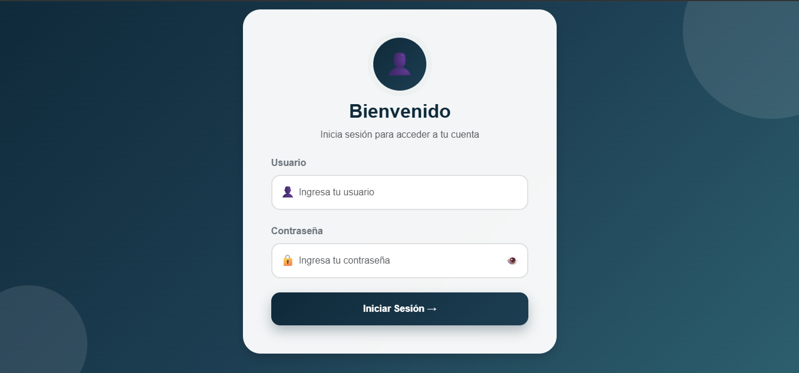

Una vez en la página de inicio de sesión, siga estos pasos:

**Paso 1**: Ingrese su **correo electrónico** registrado en el campo "Correo"
**Paso 2**: Ingrese su **contraseña** en el campo "Contraseña"
**Paso 3**: Haga clic en el botón **"Iniciar Sesión"** (botón azul)
**Paso 4**: Si los datos son correctos, será redirigido al Dashboard del sistema

*La interfaz de login es simple y directa, como se observa en `login_page.png`.*

**Información requerida para login:**
- Correo electrónico válido
- Contraseña correcta (mayúsculas y minúsculas tienen importancia)

### 5.3 Error de Autenticación

Si recibe un mensaje de error al intentar iniciar sesión, verifique:

| Error | Solucion |
|---|---|
| ❌ "Usuario o contrasena incorrectos" | Verifique que el correo sea exactamente igual al registrado. Respete mayusculas/minusculas en la contrasena. |
| ❌ "Token requerido" | Los datos llegaron correctamente, pero no se pudo generar el token. Intente de nuevo en unos momentos. |
| ❌ "Token expirado" | Su sesion ha caducado. Vuelva a iniciar sesion normalmente. Las sesiones duran 30 minutos de inactividad. |
| ❌ "Fallo de conexion" | Verifique su conexion a internet. Limpie el cache del navegador (Ctrl+Shift+Supr). |

### 5.4 Cierre de Sesion

Para cerrar sesión:

1. Localice el **botón de menú de usuario** en la esquina superior derecha del Dashboard
2. Haga clic en **"Cerrar Sesión"** o **"Logout"**
3. Será redirigido a la página de login
4. Su sesión será cancelada y deberá volver a iniciar sesión para acceder

---

## 6. MODULO ADMINISTRADOR

### 6.1 Descripcion del Rol

El **Administrador** es el usuario con maximo nivel de acceso en el sistema. Tiene responsabilidad total sobre:

- Gestion operativa del condominio
- Control financiero y de pagos
- Comunicacion con residentes
- Registro de empleados
- Generacion de reportes
- Configuracion general del sistema

### 6.2 Panel de Inicio - Dashboard

El Dashboard es la primera pantalla que ve al iniciar sesion. Muestra un resumen de la situacion actual del condominio.

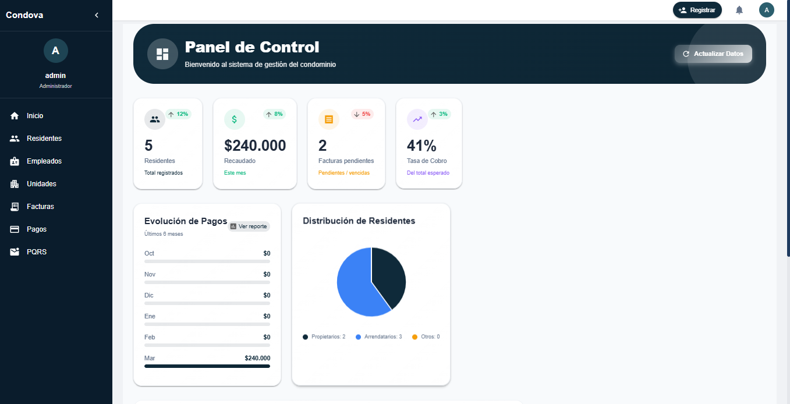

#### 6.2.1 Componentes del Dashboard

**Tarjetas de Estadisticas (Superior)**

- Total de Residentes: Numero total de personas registradas
- Total de Pagos: Suma en pesos de todos los pagos recibidos
- Solicitudes Pendientes: Cantidad de solicitudes sin tratar
- Tasa de Recoleccion: Porcentaje de pagos cobrados vs. esperados

#### 6.2.2 Acciones en el Dashboard

| Accion | Descripcion |
|---|---|
| Refrescar datos | Actualiza la informacion en tiempo real - Boton 🔄 |
| Ver estadisticas completas | Accede a reportes detallados - Boton 📊 |
| Crear nuevo comunicado | Accede al modulo de comunicados - Boton ✏️ |

### 6.3 Gestion de Unidades Habitacionales

La gestion de unidades permite administrar todas las unidades del condominio: apartamentos, casas, locales, etc.

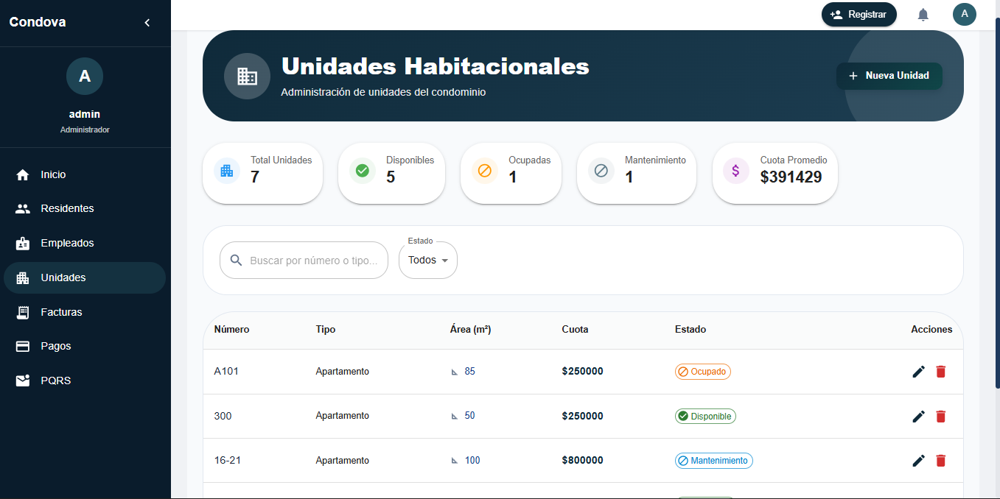

#### 6.3.1 Ver Listado de Unidades

**Acceso**: Menu principal → Unidades

Tabla con todas las unidades mostrando:

- **Numero de Unidad**: Identificador unico (Ej: 101, 202, 301)
- **Tipo de Unidad**: Apartamento, Casa, Local, Suite, etc.
- **Area**: Metros cuadrados de la unidad
- **Estado**: Disponible, Ocupada, Mantenimiento
- **Valor de Cuota**: Valor mensual a pagar por esta unidad

#### 6.3.2 Crear Nueva Unidad

1. Haga clic en **"➕ Nueva Unidad"**
2. Complete el formulario con: tipo, numero, area, valor de cuota y estado
3. Haga clic en **"Guardar"**
4. La nueva unidad aparecera en el listado

#### 6.3.3 Editar y Eliminar Unidades

- Para **editar**: haga clic en ✏️ Editar, modifique los campos y guarde.
- Para **eliminar**: haga clic en 🗑️ Eliminar y confirme la accion.

> ⚠️ **ADVERTENCIA**: La eliminacion no se puede deshacer. Asegurese antes de eliminar.

### 6.4 Gestion de Residentes

Modulo para registrar, actualizar y gestionar la informacion de todos los residentes del condominio.

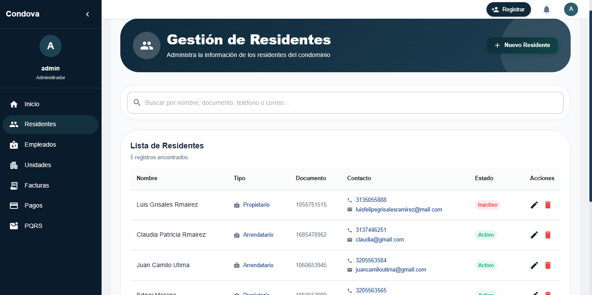

#### 6.4.1 Ver Listado de Residentes

**Acceso**: Menu principal → Residentes

Tabla con informacion de cada residente incluyendo: nombre, apellido, tipo (propietario o arrendatario), documento, telefono, correo y estado (activo o inactivo).

#### 6.4.2 Registrar Nuevo Residente

1. Haga clic en **"➕ Nuevo Residente"**
2. Complete nombre, apellido, tipo, documento, telefono, correo y estado
3. Haga clic en **"Guardar"**

### 6.5 Gestion de Pagos

Registre, verifique y controle todos los pagos del condominio.

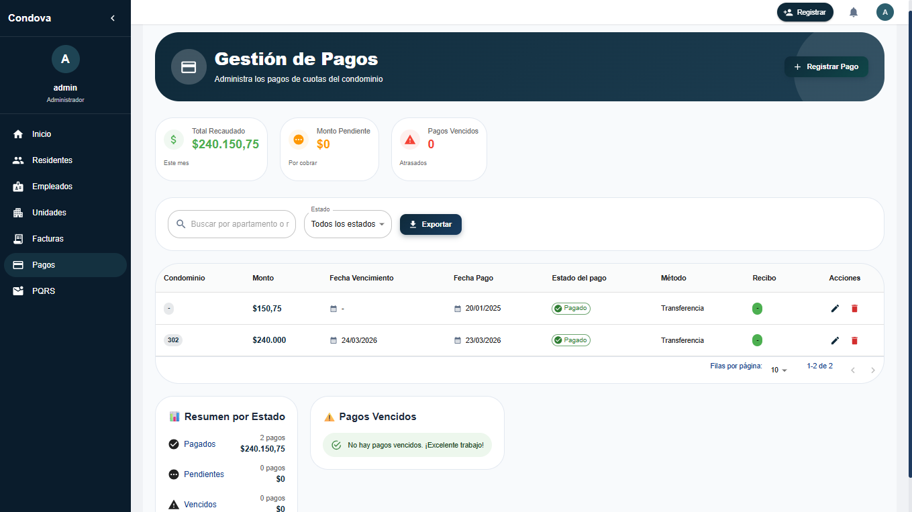

#### 6.5.1 Ver Estado de Pagos

**Acceso**: Menu principal → Pagos

| Estado | Significado |
|---|---|
| 🟢 Pagado | Pago recibido y confirmado |
| 🟡 Pendiente | Pago registrado pero no confirmado |
| 🔴 Vencido | Pago que no fue realizado en la fecha esperada |

#### 6.5.2 Registrar Nuevo Pago

1. Haga clic en **"➕ Nuevo Pago"**
2. Complete fecha, monto, metodo, estado y factura asociada
3. Haga clic en **"Guardar"**

### 6.6 Gestion de Facturas

Las facturas son documentos que se generan para cobrar la cuota mensual de cada unidad.

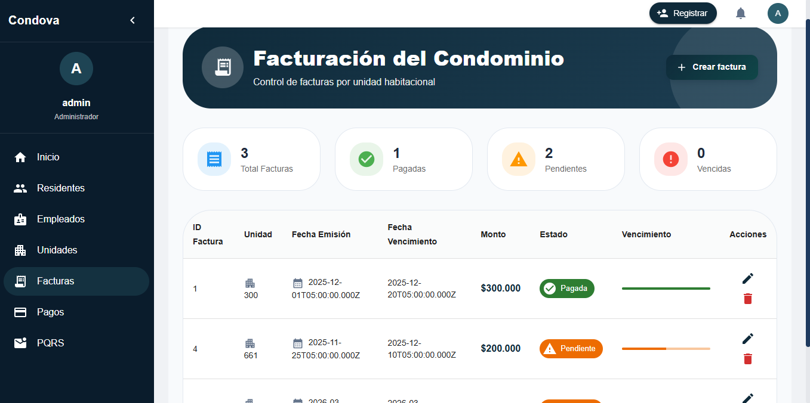

#### 6.6.1 Ver Listado de Facturas

| Campo | Descripcion |
|---|---|
| ID Factura | Numero identificador |
| Unidad | Numero de la unidad |
| Fecha Emision | Cuando se creo |
| Fecha Vencimiento | Limite de pago |
| Monto | Valor a pagar |
| Estado | Pagada, Pendiente, Vencida |

#### 6.6.2 Crear Nueva Factura

1. Haga clic en **"➕ Nueva Factura"**
2. Seleccione la unidad e ingrese fecha de emision, fecha de vencimiento, monto y estado
3. Haga clic en **"Guardar"**

### 6.7 Gestion de Comunicados

Los comunicados son avisos, anuncios y mensajes que la administracion quiere compartir. Puede acceder desde el menu de comunicados con el icono **🔔**.

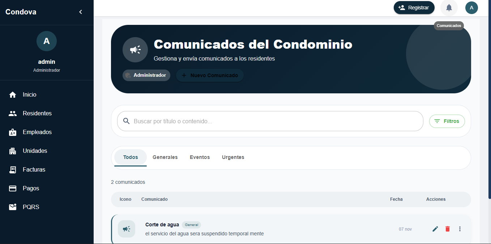

#### 6.7.1 Crear Nuevo Comunicado

1. Menu → Comunicados
2. Haga clic en **"➕ Nuevo Comunicado"**
3. Complete tipo, titulo, descripcion, fecha, destinatarios y adjunto (opcional)
4. Haga clic en **"Enviar Comunicado"**

#### 6.7.2 Tipos de Comunicados

| Tipo | Icono | Uso |
|---|---|---|
| Urgente | ⚠️ | Situaciones emergentes (falla de agua, corte de luz) |
| Evento | 📅 | Reuniones, asambleas |
| Reglamento | 📋 | Normas y regulaciones |
| Aviso | 📢 | Informacion general |

### 6.8 Gestion de Ingresos y Egresos

#### 6.8.1 Ingresos

**Que es un ingreso?** Dinero que entra al condominio (pagos de residentes, multas, intereses, etc.).

1. Menu → Ingresos
2. Haga clic en **"➕ Nuevo Ingreso"**
3. Complete fecha, concepto y monto
4. Haga clic en **"Guardar"**

#### 6.8.2 Egresos

**Que es un egreso?** Dinero que sale del condominio (salarios, servicios, mantenimiento, etc.).

1. Menu → Egresos
2. Haga clic en **"➕ Nuevo Egreso"**
3. Complete fecha, concepto, monto y empleado (opcional)
4. Haga clic en **"Guardar"**

### 6.9 Gestion de Empleados

Registre y administre el personal que trabaja en el condominio.

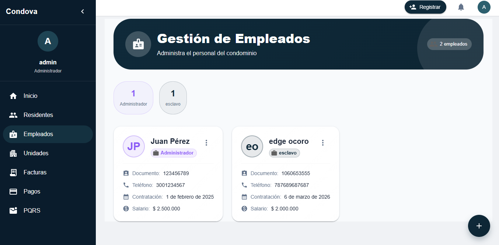

#### 6.9.1 Registrar Nuevo Empleado

1. Menu → Empleados
2. Haga clic en **"➕ Nuevo Empleado"**
3. Complete nombre, apellido, cargo, documento, telefono, fecha de contratacion y salario
4. Haga clic en **"Guardar"**

### 6.10 Gestion de PQRS

Sistema de Peticiones, Quejas, Reclamos y Sugerencias. Permite la comunicacion bidireccional entre residentes, propietarios y administracion.

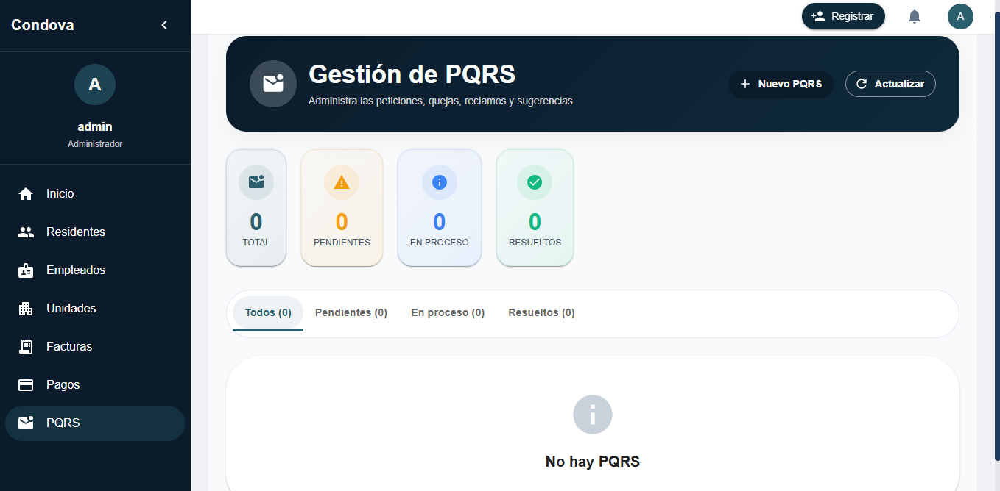

#### 6.10.1 Ver PQRS Recibidas (Administrador)

**Acceso**: Sidebar → PQRS

Como administrador, puede ver todas las PQRS enviadas por propietarios y residentes (estado, tipo, remitente, fecha, asunto y acciones).

#### 6.10.2 Responder a una PQRS

1. Haga clic en **"👁️ Ver"** en la PQRS deseada
2. Lea el contenido completo
3. Haga clic en **"Responder"** y escriba la respuesta
4. Cambie el estado si es necesario (Pendiente → En proceso → Resuelta → Cerrada)
5. Haga clic en **"Enviar Respuesta"**

#### 6.10.3 Enviar PQRS (Propietarios)

**Acceso**: Sidebar → PQRS → Enviar PQRS al Administrador

1. Seleccione el tipo (peticion, queja, reclamo, sugerencia)
2. Escriba el asunto y la descripcion
3. Haga clic en **"Enviar PQRS al Administrador"**

#### 6.10.4 Gestionar PQRS de Residentes (Propietarios)

**Acceso**: Sidebar → PQRS → PQRS Recibidas de Residentes

- Ver PQRS enviadas por residentes de sus unidades
- Responder directamente a los residentes
- Cambiar estados de las PQRS
- Comunicarse con el administrador si es necesario

---

## 7. MODULO PROPIETARIO

### 7.1 Descripcion del Rol

El **Propietario (Copropietario)** es el dueno de una o mas unidades en el condominio. Sus funciones son:

- Consultar estado de sus pagos
- Ver mis unidades
- Recibir y leer comunicados
- Actualizar informacion personal
- Ver facturas y estado de cuenta

### 7.2 Dashboard Propietario

Al iniciar sesion, el propietario ve un dashboard personalizado con:

- **Mis Unidades**: Numero de unidades que posee
- **Estado de Cuenta**: Monto adeudado o saldo disponible
- **Pagos Previos**: Proxima fecha de pago
- **Comunicados Nuevos**: Cantidad de avisos sin leer

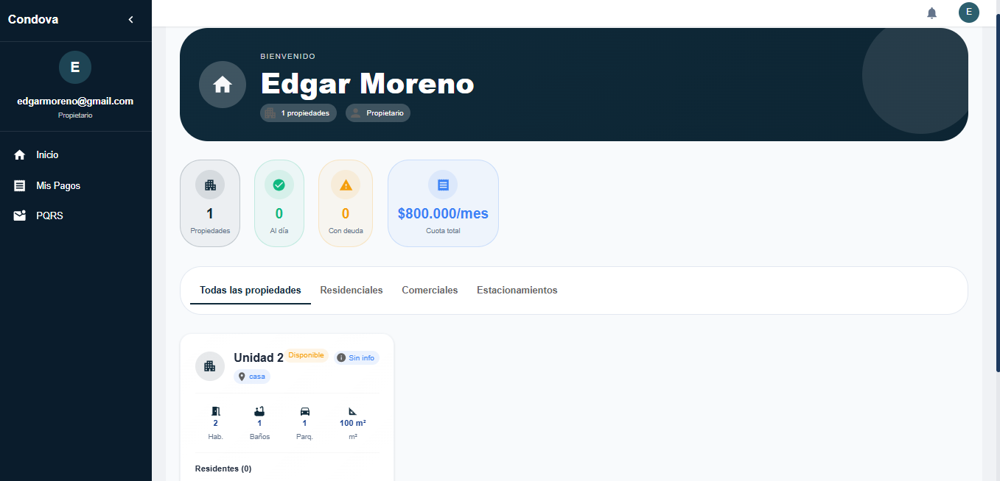

### 7.3 Mis Unidades

Al acceder a **"Mis Unidades"**, vera un listado de las unidades que posee con: numero de unidad, tipo, area, valor de cuota, residentes actuales (si esta ocupada) y ultimo pago realizado.

### 7.4 Mis Pagos

**Esta es la seccion mas importante para el propietario.** Aqui puede gestionar y visualizar todos sus pagos de gastos comunes en un solo lugar.

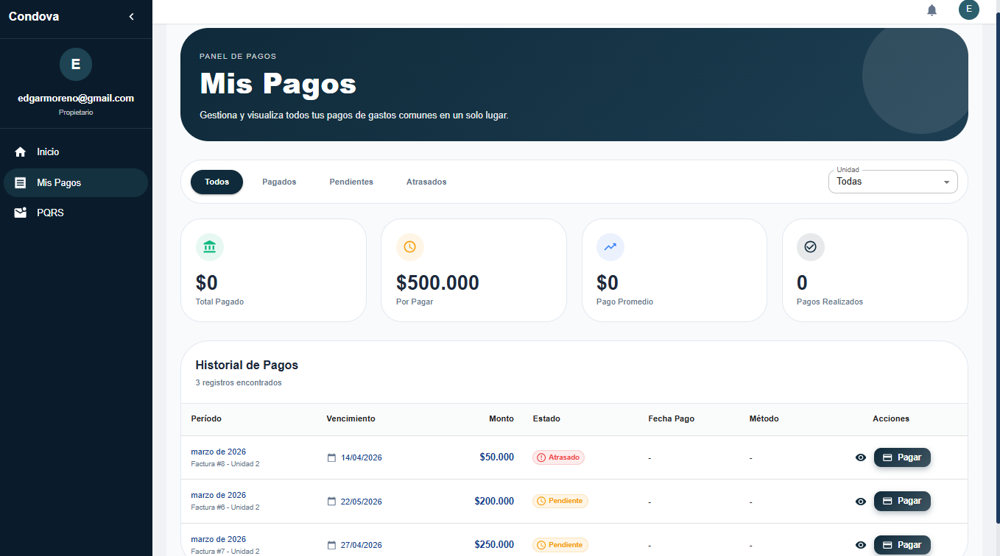

El propietario puede visualizar:

| Concepto | Descripcion |
|---|---|
| Saldo Anterior | Lo que debia el mes pasado |
| Cuota Mensual | Monto a pagar este mes |
| Pagos pendientes | Cantidad de pagos pendientes |
| Saldo Actual | Lo que debe ahora |
| Estado de pagos | Estado de cada pago |
| Historial de todos los pagos | Registro completo de pagos realizados |

#### 7.4.1 Descargar Recibos

1. Haga clic en **📥 Descargar Recibo**
2. Se descargara un PDF con el comprobante
3. Use el comprobante para sus registros contables

### 7.5 Mis Facturas

Ver todas las facturas (cobros) que ha recibido.

#### 7.5.1 Estados de Factura

- 🟢 **Pagada**: Factura ya fue pagada
- 🟡 **Pendiente**: Factura sin pagar pero dentro del plazo
- 🔴 **Vencida**: Factura que paso la fecha de vencimiento

#### 7.5.2 Acciones en Facturas

- 👁️ Ver: Consultar detalles
- 📥 Descargar PDF: Obtener copia
- 💳 Pagar Ahora: Registrar un pago

### 7.6 Comunicados

Seccion donde ve todos los avisos y comunicaciones de la administracion.

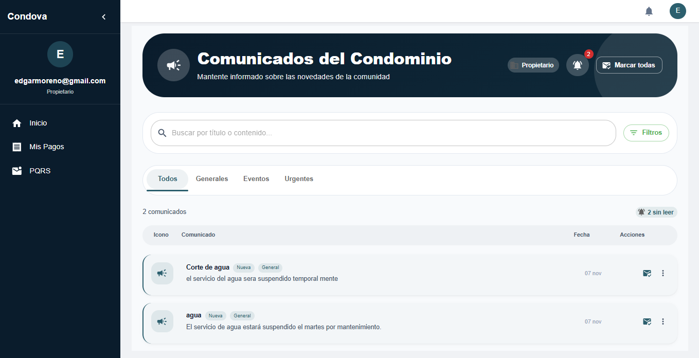

#### 7.6.1 Ver y Leer Comunicados

1. Menu → Comunicados
2. Vea la lista de comunicados con tipo, titulo y fecha
3. Haga clic en uno para leer el contenido completo
4. Descargue adjuntos si existen

### 7.7 Mi Perfil

Para ingresar al perfil del propietario vaya a la parte superior derecha donde aparece el circulo con la inicial; alli mismo vera la opcion para cerrar sesion.

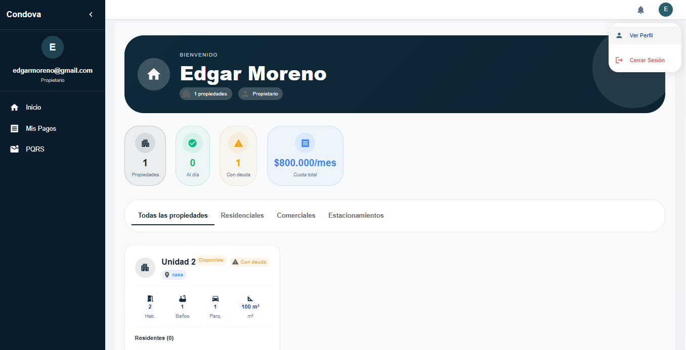

Podra visualizar y actualizar:

- Informacion personal
- Numero de unidad (Ej: 302)
- Tipo (Apartamento, Casa, etc.)
- Informacion de habitantes, mascotas y vehiculos en la unidad

---

## 8. MODULO RESIDENTE

### 8.1 Descripcion del Rol

El **Residente** es una persona que vive en el condominio pero no es propietario (generalmente arrendatario). Sus funciones son:

- Recibir y leer comunicados
- Consultar y gestionar pagos (segun permisos)
- Actualizar informacion personal
- Acceso limitado a informacion general

### 8.2 Dashboard Residente

Al iniciar sesion, el residente ve un dashboard basico con:

- Bienvenida personalizada
- **Mi Unidad**: Numero de unidad donde vive
- **Comunicados Nuevos**: Cantidad de avisos sin leer
- **Informacion de Contacto**: Numero de emergencia

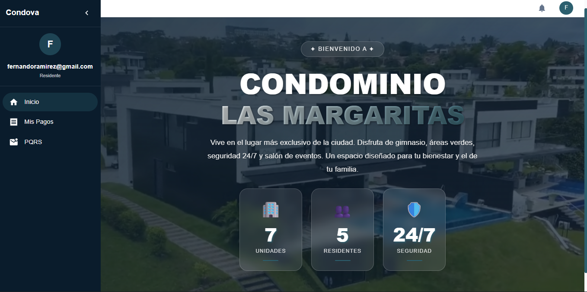

### 8.3 Pagos

Donde el residente puede gestionar y visualizar sus pagos de gastos comunes.

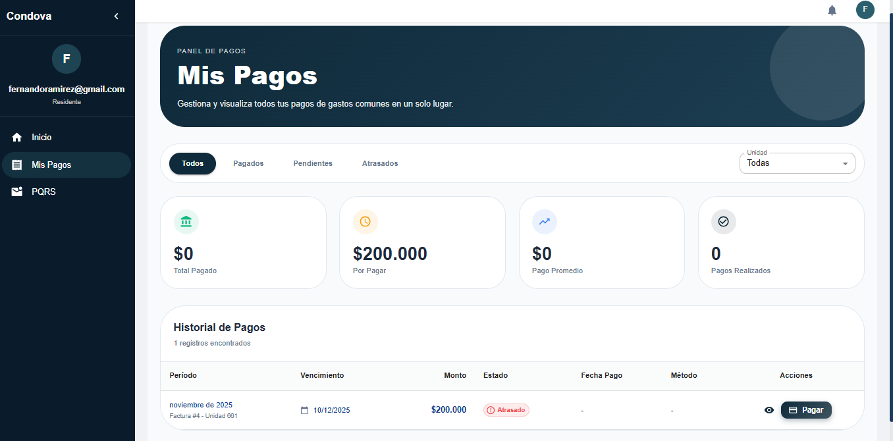

El residente puede visualizar:

| Concepto | Descripcion |
|---|---|
| Saldo Anterior | Lo que debia el mes pasado |
| Cuota Mensual | Monto a pagar este mes |
| Pagos pendientes | Cantidad de pagos pendientes |
| Saldo Actual | Lo que debe ahora |
| Estado de pagos | Estado de cada pago |
| Historial de todos los pagos | Registro completo de pagos realizados |

### 8.4 Comunicados

Los comunicados son avisos, anuncios y mensajes que la administracion quiere compartir. Puede acceder desde el menu con el icono **🔔**.

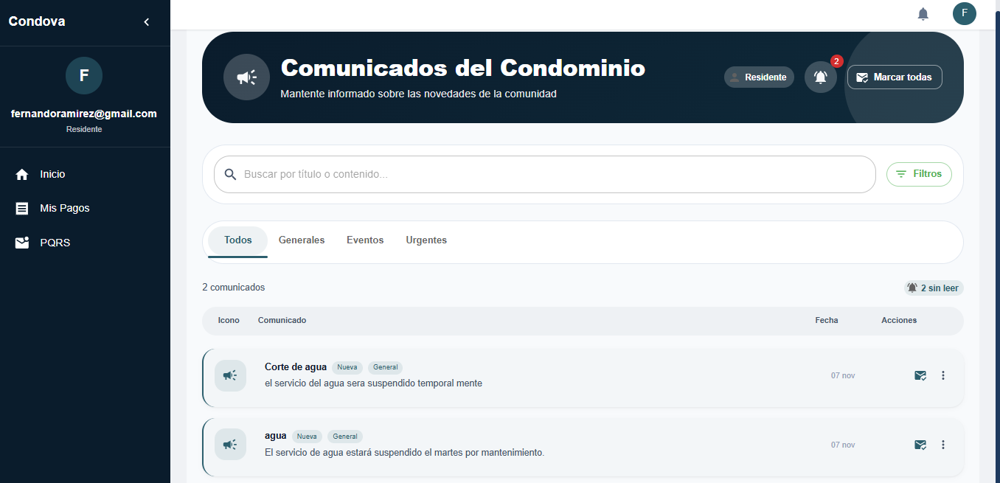

#### 8.4.1 Ver Comunicados

**Acceso**: Menu → Comunicados

Vera un listado con comunicados clasificados por tipo, titulo, fecha de envio y si ya fue leido ✅ o no ❌.

#### 8.4.2 Leer un Comunicado

1. Haga clic en el comunicado que desea leer
2. Se abrira una ventana con titulo, texto completo, fecha/hora y adjuntos (si existen)
3. Cierre la ventana cuando termine

### 8.5 Mi Perfil

Para ingresar al perfil del residente vaya a la parte superior derecha donde aparece el circulo con la inicial; alli mismo vera la opcion para cerrar sesion.

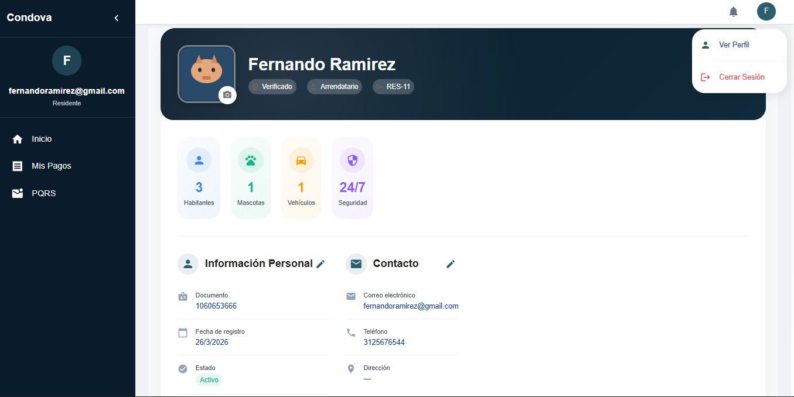

Podra visualizar y actualizar:

- Informacion personal
- Numero de unidad (Ej: 302)
- Tipo (Apartamento, Casa, etc.)
- Informacion de habitantes, mascotas y vehiculos en la unidad

---

## 9. SOPORTE Y CONTACTO

### 9.1 Canales de Soporte Disponibles

Cuando necesite ayuda, puede contactarnos por:

| Canal | Detalles |
|-------|----------|
| **Email** | soporte@condominio.local |
| **Teléfono** | +57 (1) 1234-5678 |
| **Chat en Línea** | Disponible en horario laboral (8 AM - 6 PM) |
| **Presencial** | Oficina de Administración - Lunes a Viernes 9 AM - 5 PM |

### 9.2 Recomendaciones para Reportar un Problema

ANTES de contactar, intente:

✅ Actualizar la pagina (Presione F5)
✅ Limpiar cache del navegador
✅ Probar en otro navegador
✅ Verificar su conexion a internet
✅ Cerrar sesion y abrir sesion nuevamente

AL reportar, proporcione:

1. **Descripcion clara**: que modulo y que esta haciendo exactamente
2. **Capturas de pantalla**: del problema y del mensaje de error
3. **Informacion tecnica**: navegador, dispositivo y sistema operativo
4. **Acciones realizadas**: paso a paso
5. **Hora de ocurrencia**: cuando sucedio

### 9.3 Preguntas Frecuentes (FAQ)

**P: ¿Cuanto tiempo tarda en procesarse un pago?**

R: Despues de registrarse, el pago se marca como "Pendiente" hasta que sea confirmado por administracion (generalmente 1-2 dias).

**P: ¿Puedo cambiar mi correo electronico?**

R: Debe contactar a administracion para cambiar su correo. Por seguridad, no se puede cambiar desde el perfil.

**P: ¿Que hago si recibo un comunicado importante pero no sale en el sistema?**

R: Actualice la pagina (F5) o desconectese y vuelva a conectarse. Si persiste, contacte soporte.

**P: ¿Como descargo un comprobante de pago?**

R: En "Mis Pagos", haga clic en el icono 📥 del pago y se descargara un PDF.

**P: ¿Se puede eliminar una factura?**

R: Solo el administrador puede eliminar facturas, y solo en casos excepcionales.

### 9.4 Horario de Atencion

| Día | Horario | Disponibilidad |
|-----|---------|-----------------|
| **Lunes a Viernes** | 8:00 AM - 6:00 PM | ✅ Atención Normal |
| **Sábados** | 9:00 AM - 1:00 PM | ⚠️ Atención Limitada |
| **Domingos y Festivos** | Cerrado | ❌ Solo urgencias |

---

## GLOSARIO

| Término | Definición |
|---------|-----------|
| **Administrador** | Usuario con acceso total al sistema |
| **Arrendatario** | Persona que vive en una unidad pero no la posee |
| **Cuota** | Monto mensual que debe pagar cada propietario |
| **Egreso** | Gasto o dinero que sale del condominio |
| **Token JWT** | Sistema de seguridad que verifica quién eres |
| **Factura** | Documento de cobro de la cuota mensual |
| **Ingreso** | Dinero que entra al condominio (pagos) |
| **Propietario** | Dueño de una o más unidades |
| **Residente** | Persona que vive en el condominio |
| **Unidad** | Unidad habitacional (apartamento, casa, etc.) |

---

## VERSIÓN DEL DOCUMENTO

| Versión | Fecha | Cambios |
|---------|-------|---------|
| 1.0 | Marzo 25, 2026 | Creación inicial del manual |

---

## CRÉDITOS Y AUTORÍA

**Manual de Usuario creado para:**
Sistema de Administración de Unidades Horizontales - Condominio Las Margaritas

**Fecha de generación:** Marzo 25, 2026
**Idioma:** Español (Colombia)
**Licencia:** Uso interno - Protegido por derechos de autor

---

### NOTAS FINALES

Este manual está diseñado para ser completo y accesible para usuarios sin conocimientos técnicos. Si nota algún error, información incorrecta o secciones difíciles de entender, favor contacte a soporte.

**Recuerde:** La plataforma está aquí para facilitarle la vida. No dude en pedir ayuda cuando la necesite.

¡Gracias por usar el Sistema de Administración de Unidades Horizontales!
